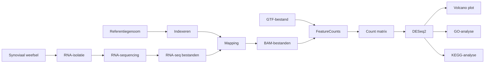

#  Genexpressieanalyse wijst op verstoring van immuungerelateerde processen bij reumatoïde artritis

##  Inleiding  
Reumatoïde artritis (RA) is een chronische auto-immuunziekte die wordt gekenmerkt door ontsteking van synoviaal weefsel en progressieve gewrichtsschade. Immuuncellen zoals T-cellen, B-cellen en macrofagen infiltreren het gewricht en veroorzaken ontstekingsprocessen en weefselafbraak (Miyabe et al., 2020). Chemokines en cytokines spelen hierbij een belangrijke rol doordat zij de activatie en migratie van immuuncellen reguleren (Miyabe et al., 2020).

RNA sequencing (RNA-seq) maakt het mogelijk om genexpressie op genome-wide niveau te analyseren en verschillen tussen ziekte en controle te identificeren. Deze techniek wordt veel toegepast om de moleculaire mechanismen achter complexe ziekten, zoals RA, beter te begrijpen (Love et al., 2014; Stephenson et al., 2018).

Het doel van dit project is om met behulp van RNA-seq data inzicht te verkrijgen in de moleculaire processen die betrokken zijn bij reumatoïde artritis. Hiervoor wordt eerst onderzocht welke genen significant differentieel geëxprimeerd zijn tussen RA-patiënten en gezonde controles. Vervolgens wordt met een Gene Ontology (GO)-analyse bepaald welke biologische processen verrijkt zijn onder deze differentieel geëxprimeerde genen. Ten slotte wordt gekeken welke genen en immuunmechanismen betrokken zijn binnen de KEGG pathway *Autoimmune Thyroid Disease* (hsa05320) en hoe deze samenhangen met de gevonden genexpressieveranderingen. Door deze analyses te combineren kan beter worden begrepen welke moleculaire en immunologische processen een rol spelen bij RA.

---
## Workflow

*Figuur 1.* Workflow van de uitgevoerde transcriptomics-analyse.

---

##  Methode  
Voor deze studie werd gebruikgemaakt van een publieke RNA-seq dataset van synoviaal weefsel afkomstig van 4 reumatoïde artritis (RA) patiënten en 4 gezonde controles. Uit het synoviale weefsel werd totaal RNA geïsoleerd en vervolgens gebruikt voor RNA sequencing (RNA-seq), waarmee genexpressie op genome-wide niveau kan worden bepaald (Fraenkel et al., 2021; Stephenson et al., 2018).

De bio-informatica-analyse is uitgevoerd in R (v4.4.1) en Bioconductor (v3.19). Ruwe sequencing reads werden uitgelijnd tegen het humane referentiegenoom (GRCh38) met *Rsubread* (v2.18.0) (Liao et al., 2019). Vervolgens werden reads toegewezen aan genen met *featureCounts* (v2.18.0), wat resulteerde in een count matrix (Liao et al., 2014).

Differentiële genexpressieanalyse werd uitgevoerd met *DESeq2* (v1.44.0). Genen met een adjusted p-value < 0,05 en een |log2 fold change| > 1 werden als significant beschouwd (Love et al., 2014).

Functionele analyse werd uitgevoerd met *goseq* (v1.56.0) voor Gene Ontology-verrijking (Young et al., 2010). KEGG pathway-analyse werd uitgevoerd met *KEGGREST* (v1.44.0) en gevisualiseerd met *pathview* (v1.44.0) (Kanehisa & Goto, 2000).

**Tabel 1.** Overzicht van de gebruikte RNA-seq samples. De dataset bestaat uit vier gezonde controles (Normal) en vier patiënten met reumatoïde artritis (Rheumatoid arthritis).
| Naam | Conditie |
|------|-----------|
| SRR4785819 | Normal |
| SRR4785820 | Normal |
| SRR4785828 | Normal |
| SRR4785831 | Normal |
| SRR4785979 | Rheumatoid arthritis |
| SRR4785980 | Rheumatoid arthritis |
| SRR4785986 | Rheumatoid arthritis |
| SRR4785988 | Rheumatoid arthritis |

---

##  Resultaten  
De differentiële genexpressieanalyse met DESeq2 identificeerde 4572 significant differentieel geëxprimeerde genen (padj < 0,05). Van deze genen waren 2085 opgereguleerd en 2487 neergereguleerd in reumatoïde artritispatiënten ten opzichte van gezonde controles.

  

*Figuur 2.* Volcano plot van de differentiële genexpressieanalyse tussen RA- en controlesamples. Punten boven de significantiedrempel (padj < 0,05) vertegenwoordigen significant differentieel geëxprimeerde genen.

  

De volcano plot laat een duidelijke scheiding zien tussen op- en neergereguleerde genen. Genen zoals *IGHV3-53*, *IGHV1-69* en *PTGFR* vertoonden een verhoogde expressie, terwijl *ANKRD30BL*, *MT-ND6* en *SLC9A3R2* juist een lagere expressie lieten zien in RA-patiënten.

*Figuur 2.* Top verrijkte GO-termen van de differentieel geëxprimeerde genen.

Om de biologische betekenis van deze genexpressieveranderingen verder te onderzoeken, werd een Gene Ontology (GO)-analyse uitgevoerd. Hierbij werden meerdere significant verrijkte biologische processen gevonden (over_represented_pvalue < 0,05), waaronder verschillende processen gerelateerd aan immuunactiviteit.

Daarnaast werd een KEGG pathway-analyse uitgevoerd. Binnen de pathway *Autoimmune Thyroid Disease* (hsa05320) werden meerdere genen met veranderde expressie waargenomen.

  

**Figuur 3.** KEGG pathway *Autoimmune Thyroid Disease* (hsa05320) met weergegeven genexpressieveranderingen.

**Tabel 2.** Belangrijke genen binnen de KEGG pathway *Autoimmune Thyroid Disease* (hsa05320).

| Gen | Verandering | Functie |
|------|------------|----------|
| MHC II | Verhoogd | Antigeenpresentatie aan T-cellen |
| CD28 | Verhoogd | Co-stimulatie van T-cellen |
| IL-4 | Verhoogd | Cytokine voor immuunregulatie |
| MHC I | Verlaagd | Antigeenpresentatie aan cytotoxische T-cellen |
| IL-2 | Verlaagd | Regulatie van T-cellen |

Binnen de pathway werden verhoogde expressieniveaus waargenomen voor MHC II, CD28 en IL-4, terwijl MHC I en IL-2 een lagere expressie vertoonden.

---

##  Conclusie  
Het doel van dit project was om genexpressieverschillen tussen reumatoïde artritispatiënten en gezonde controles te identificeren en biologisch te interpreteren. De differentiële genexpressieanalyse liet zien dat meerdere genen significant verschilden tussen beide groepen. Daarnaast identificeerde de Gene Ontology-analyse meerdere verrijkte biologische processen die voornamelijk gerelateerd waren aan immuunactiviteit.

De analyse van de KEGG pathway *Autoimmune Thyroid Disease* (hsa05320) toonde veranderingen in genen betrokken bij antigeenpresentatie en T-celactivatie. Hierbij vertoonden MHC II, CD28 en IL-4 een verhoogde expressie, terwijl MHC I en IL-2 een verlaagde expressie lieten zien. Deze bevindingen wijzen op veranderingen in immuungerelateerde signaleringsroutes.

Door de combinatie van differentiële genexpressie-, GO- en KEGG-analyses werd meer inzicht verkregen in de moleculaire processen die geassocieerd zijn met reumatoïde artritis. De resultaten benadrukken het belang van immuungerelateerde mechanismen en laten zien hoe transcriptomics kan bijdragen aan het bestuderen van complexe auto-immuunziekten.

Een beperking van dit project/study is dat de sample groep te klein is met 8

---

### Bronnen
De gebruikte bronnen voor deze study zijn te vinden in de map /bronnen

---

### AI gebruik
Deze study heeft gebruik gemaakt van AI zoals copilot bij het formuleren van de tekst en het organiseren van bronnen. De analyses, interpretatie en vinden van bronnen zijn self door de student gedaan
